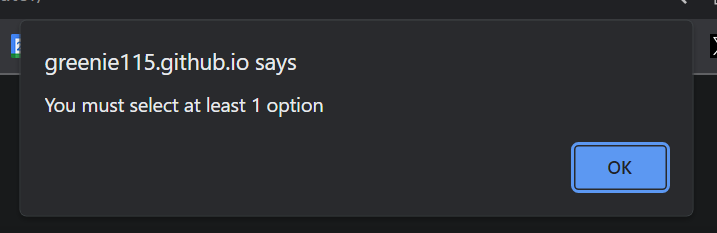

# Password Generator
Live deployed link - https://greenie115.github.io/password-generator/

This password generator allows the user to generate a random password based on their selected preferences. The user first selects the length of the password via a prompt. The user then chooses what other conditions they would like. Special characters, upper case, lower case, and numbers. 

Final Result


Initial Prompt


Minimum Character Error Handler


No Characters Selected Error Handler



## Installation
There is no installation for this product. Simply open the ```index.html``` and the page will load with prompts 

## Usage
Usage of the web app is explained throughout the ```script.js``` file with comments. Each function provides a different area of the password-generating feature.

Prompt and Error Handler Function


Random Value Function


Adding character Based on User Prompt


## Contributing
Pull requests are welcome. For major changes, please open an issue first
to discuss what you would like to change.

Please make sure to update tests as appropriate.

## License

[MIT](https://choosealicense.com/licenses/mit/)